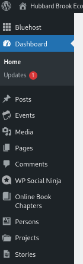
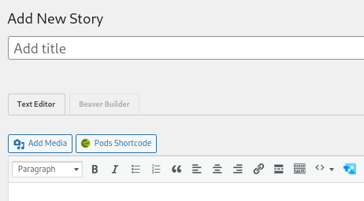
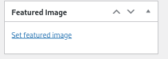

# Website

The Hubbard Brook website is developed in WordPress and hosted on Bluehost. Admin access is granted to the HBR IM and to the WordPress consultant. Details on the setup of the site, hosting account access, domain name management, plugin accounts and codes are all maintained off-line and can be accessed by the HBR IM as necessary (files are on Hubbard Brook Research Foundation 'Hubbard Brook Website' shared drive).

This document is limited to tools and tips for maintaining the current content and for adding new content.

Instructions for Adding Website Content

## Content editing access

Admin and contributors have login accounts for the website. HBR IM is the admin for this site and content creators are added as necessary.

## Adding Feature Stories

Feature stories are added as a custom post type - locate ‘Stories’ in the left sidebar, and ‘add new’.  

In the add new window, enter in a title for the story. 

Also enter a featured image. This can be an existing element in the media library or new image that you upload. See notes on general tips for adding [media](https://docs.google.com/document/d/1TSZRjaUc_CaDaMVfJCyVbMZNTmgmlQdjo5VrUXC_G78/edit#bookmark=id.c61l85oi109w). Since multiple stories are displayed in a ‘feed’, this will look best if you use an image with the general aspect of 2wide x 1 high.

Once the title and featured image are entered, select the ‘Beaver Builder’ tab. Then [see section](https://docs.google.com/document/d/1TSZRjaUc_CaDaMVfJCyVbMZNTmgmlQdjo5VrUXC_G78/edit#bookmark=id.tg5gqr1r0on) on general instructions for Beaver Builder layouts.

## Adding News posts

News posts are usually pretty straight forward and simple format. Sometimes just pointing to something in external media. These do not use Beaver Builder, just the regular text editor. If the item is more involved and media-rich, consider making this a ‘Feature Story’.

* Add new post.
* Add title
* Add featured image  - [see image instructions]
* Add featured image  - [see image instructions]()
* Enter news article in the text editor, not beaver builder. 

NOTE: when transferring older news articles from the drupal site, use this checklist to indicate status  (y=now on wordpress; changed to a feature story; save archive, but do not put on wp site; etc)

https://docs.google.com/spreadsheets/d/1yPRhX9DHN1tL8_EQAt9WCQloV5xwf4tymI009C2Pfic/edit?usp=sharing

## Creating new pages

Pages are typically used for more static website content. Pages are typically accessed through the high level menu, or from links within existing pages

* Add new page
* Add title
* Enter Beaver Builder mode to construct page

## Adding new People pages

To add profile pages to the website, request the following information. This list is included in the Welcome email template.

There is a dedicated page type for 'Persons" in the left website admin dashboard. Note the tags that can be selected on the right hand side when you open the "Person' template. information entry is through this form, with the text block at the top to contain the research interest statement. Just a little quirk....that statement must include a '.'

Also, add the following zotpress code to include that person's HBR bibliography at the bottom of their page (where last_f is replaced with lastname_firstInitial:

\[zotpress tag="last_f" sortby="date" order="desc"\]

\
\*Name:

\*Institution:

\*Department:

\*Address:

Phone:

Email:

ORCID:

Institution Homepage Link:

\*A short Research Interest Statement:

\*Please attach a photo!

For Grad Student profiles:

\*Advisor:

\*MS or PhD:

## Adding Lessons

* Add new page
* Set page type to k-12Lesson
* Set parent to k-12 Education Program
* Enter Beaver Builder
* Select Templates/SavedTemplates/LessonTemplate
* Enter descriptive text in left column
* Enter lesson assets in right column

## Adding content to the media library

Media can be added directly to the media library by going to media on the left sidebar dashboard, or it can be added at the time of page/post editing by using the ‘add media’ button in the beaver builder text editor.

### JPG are preferred format

When uploading most types of graphics and photos, use the JPG/JPEG file format as it uses the least amount of space. If you take a screenshot, which creates a PNG, you can use any basic photo editor to change to a JPG.

### Naming of media files

Try to use a filename that is descriptive, but not too long. This can be super helpful when working on the site and searching for photos to use in layouts. For example, if I’m working on a page and need a photo of a person, it’s super easy to find those photos via the media library search when the filenames are something like “jane-smith-2022portrait.jpg”, and not ‘screenshot-20260320.jpg’.

### Duplicate images

It is easy to get image-creep when you fine tune images within the media folder. It’s fine to do that, but when you’ve settled on the image version to use, please go back and delete the copies.

### Uploading PDFs for general use (not using PDF viewer)\*\*

PDFs uploaded via ‘media’ button in the beaver builder text block will display image of pdf as a pdf viewer. If you just want a link to the pdf to to the Wordpress Dashboard, go to the Media menu item, select ‘Add New’ and upload. Then in text block, just add it as a link (do not use media button).

## General tips on Beaver Builder (BB) layouts

BB General Documentation

https://docs.wpbeaverbuilder.com/beaver-builder

BB Rows

https://docs.wpbeaverbuilder.com/beaver-builder/layouts/rows/work-with-rows

BB Modules

https://docs.wpbeaverbuilder.com/beaver-builder/layouts/modules/module-overview

BB YouTube

https://www.youtube.com/c/BeaverBuilderWP/featured

## Setting publication status and visibility

When developing pages, visibility can be set to password if you really don't want it discovered. If it is fully published but not linked in to menu or pages, and not a sensitive development page, then it is unlikely to be seen unless you share the direct link.

## Theme colors

* #b75229 (link color, button background)
* #507282 (heading color, button hover color)
* #231f20 (text color)

## Headings

When designating heading sizes on pages, there should only be one H1 heading per page/post as the H1 is designated for the page title. This is automatically done in the title/BCs/search bar, so when working on pages, you should only be designating H2 or smaller (and you can use multiple H2s and smaller per page/post). Here is an example:

[https://hubbardbrook.org/policy-briefings-youth-climate-forums/](https://hubbardbrook.org/policy-briefings-youth-climate-forums/)

* Policy Briefings & Youth Climate Forums in the title/BCs/search bar gets the h1 designation
* The Policy Briefings text and the Youth Climate Forums text in their sections gets h2 because those are the second most important headings
* Other headings can get h3 or smaller depending on their importance

An article about this:

[https://yoast.com/how-to-use-headings-on-your-site/](https://yoast.com/how-to-use-headings-on-your-site/)

## Migrating content (via cut/paste)

When cutting and pasting text from documents or other websites, it is important to switch to the ‘text’ tab (not ‘visual’) in the text editor. This will paste the content in plain text, and not drag along any formatting bits from the originating document.
